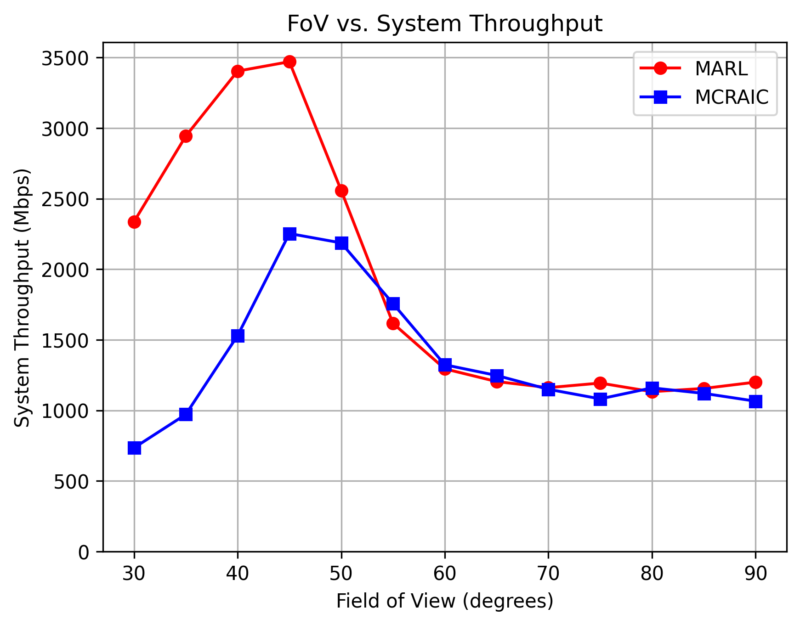
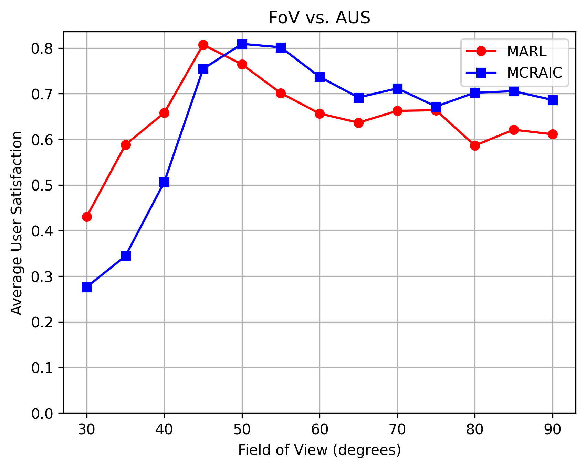
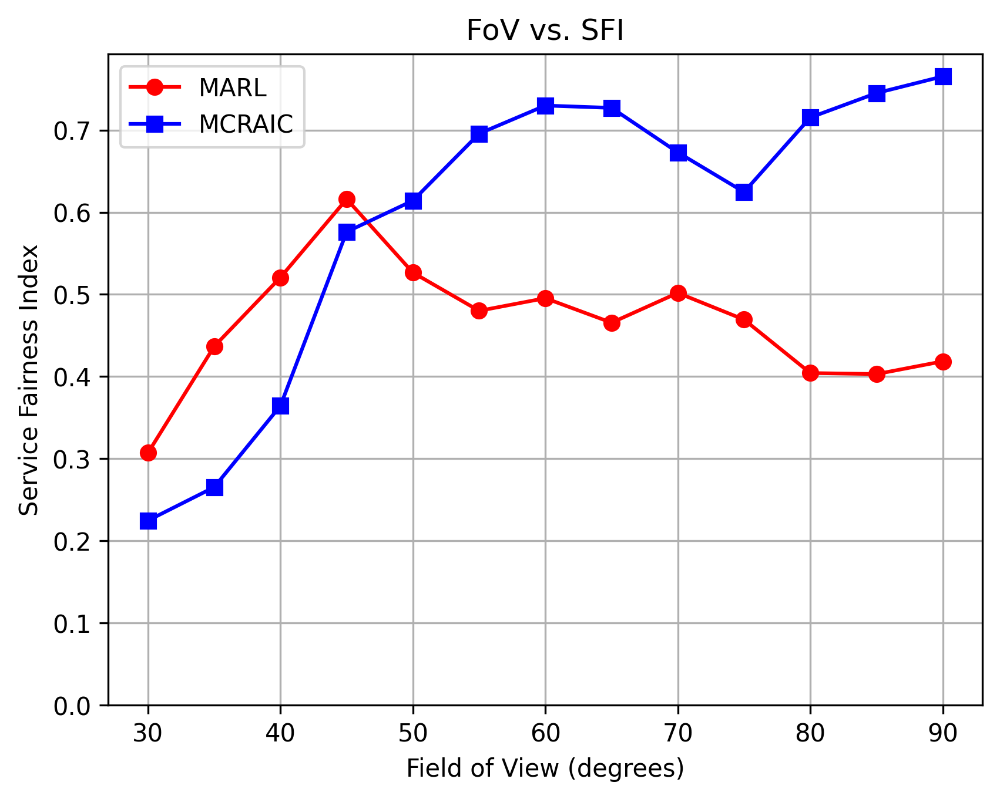
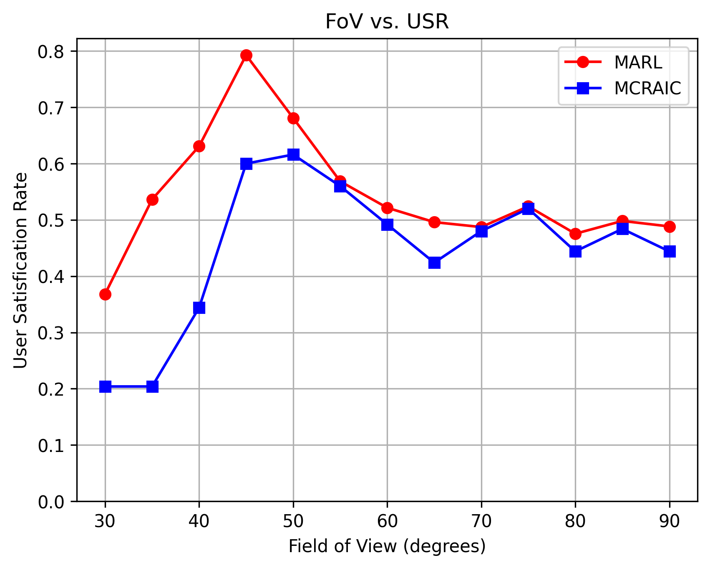
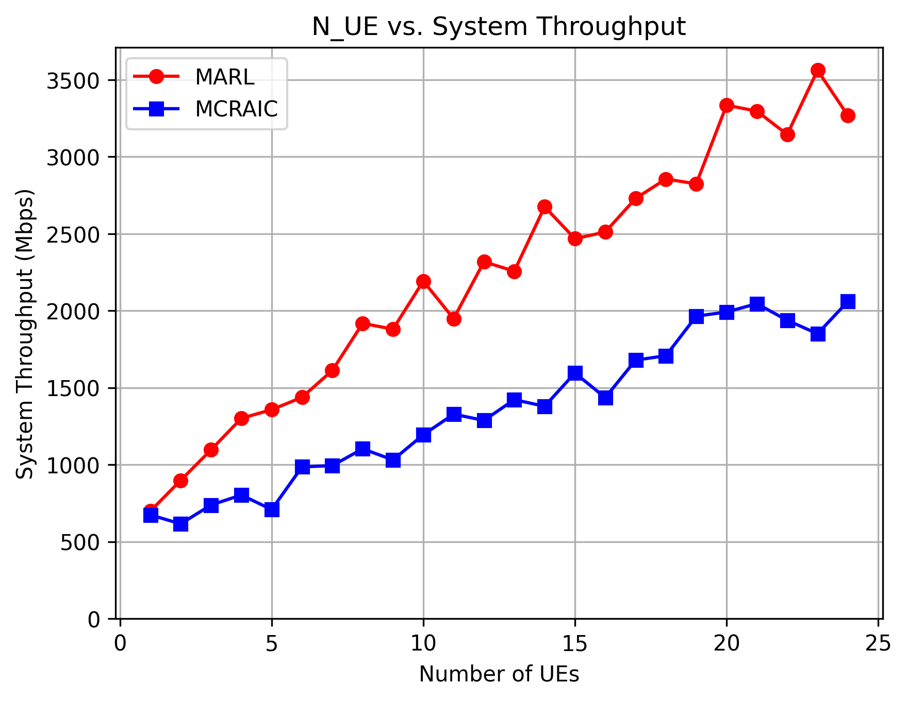
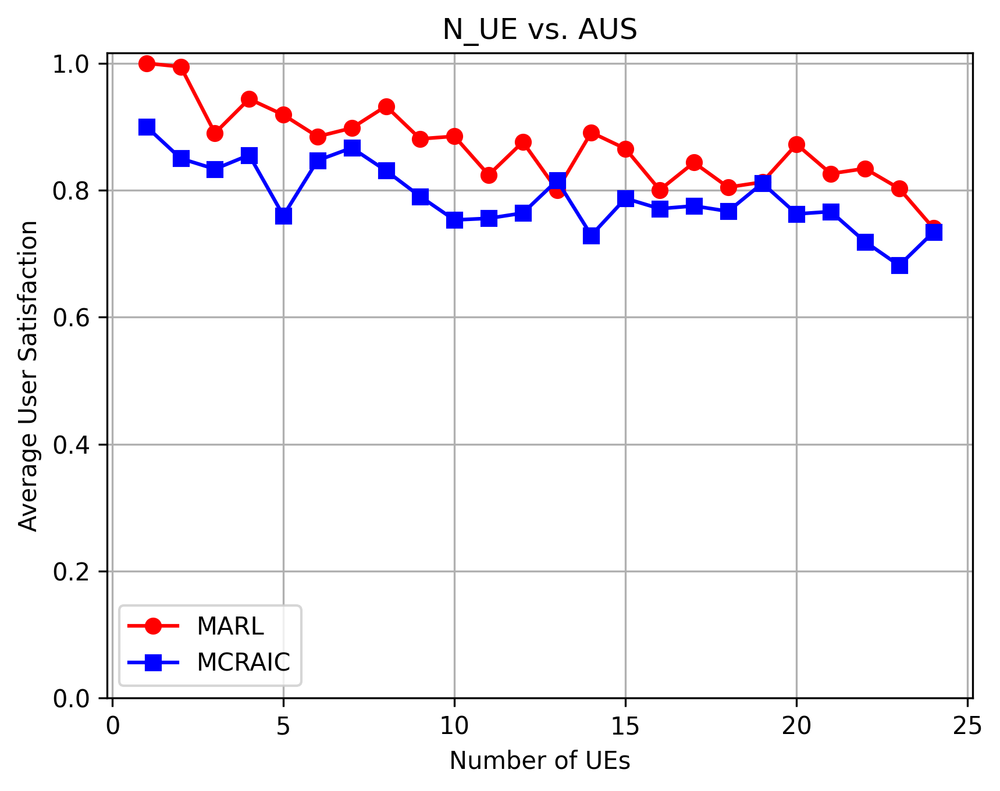
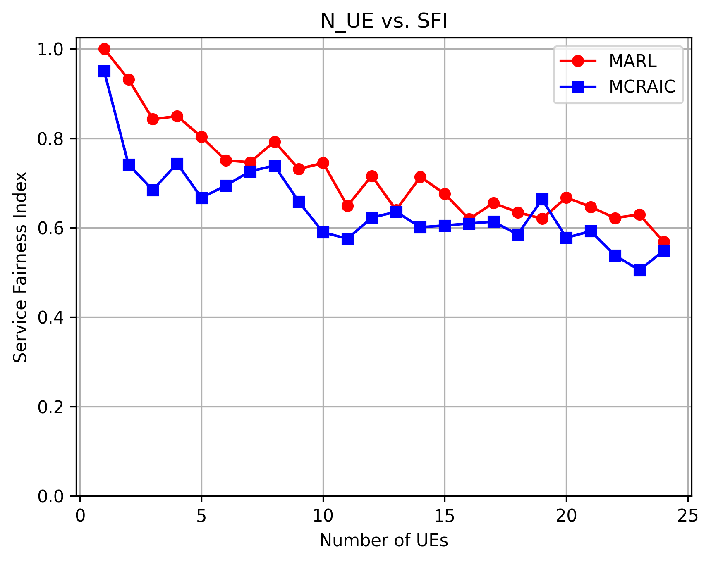
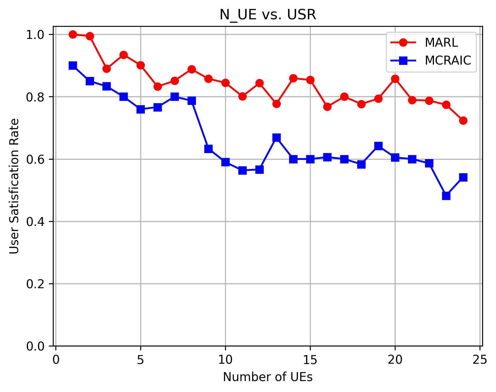

# LiWiSim
Experiments on Hybrid Multi-Color VLC/WiFi Network Optimization

This project investigates resource allocation in an indoor hybrid wireless network composed of multi-color VLC (Visible Light Communication) and WiFi access points. The goal is to maximize network performance by optimizing user-to-AP assignments and bandwidth allocation using reinforcement learning techniques.

## Simulation Environment

- **Room dimensions:** 10m × 10m × 3m  
- **Receiver plane height:** 1.2m  
- **VLC APs:** 16  |  **WiFi APs:** 1  
- **Default number of UEs:** 25  
- **Default FoV:** 45°  

### VLC Parameters
- Transmit optical power:
  - Red: 20 dBm × 0.333
  - Green: 20 dBm × 0.38
  - Blue: 20 dBm × 0.287
- Bandwidth: 20 Hz
- Semi-angle at half power: 60°
- Optical filter gain: 1  
- PD area: 1 cm²  
- O/E conversion:
  - Red: 0.44 A/W Green: 0.23 A/W Blue: 0.15 A/W  
- Power range: 50 μW to 10 mW  

### WiFi Parameters
- Transmit power: 20 dBm  
- Bandwidth: 20 MHz  
- Noise spectral density: –174 dBm/Hz  
- Receiver range: –125 dBm to 50 dBm 

Simulation episodes: 700

Repetitions per configuration: 10

## Experiments
### FoV Sweep:

Fixed: N_UE = 25

FoV Range: 30° to 90°

Purpose: Evaluate impact of PD field of view on performance

### User Count Sweep:

Fixed: FoV = 45°

N_UE Range: 1 to 25

Purpose: Observe how increasing user density affects performance

## Evaluation Metrics
* STP (System Throughput)

* AUS (Average User Satisfaction)

* SFI (Service Fairness Index)

* USR (User Satisfaction Rate)

## Algorithms
Proposed:

`Multi-Agent Reinforcement Learning (MARL)`:
* Each UE is treated as an agent deciding whether to connect to VLC or WiFi. The MARL model is integrated with a heuristic VLC bandwidth allocator to enhance throughput and fairness.

Baseline (Benchmark):

`MCRAIC`:
* A heuristic multi-cell resource allocation mechanism based on interference control.

## Goal
The experiments aim to maximize system performance and fairness in indoor heterogeneous multi-color VLC/WiFi networks through intelligent access selection and resource allocation.

## Experiment Results

### FoV vs. Performance Metrics

Figure 1: FoV vs. System Throughput (STP)

Figure 2: FoV vs. Average User Satisfaction (AUS)

Figure 3: FoV vs. Service Fairness Index (SFI)

Figure 4: FoV vs. User Satisfaction Rate (USR)

### Number of UEs vs. Performance Metrics

Figure 5: Number of UEs vs. System Throughput (STP)

Figure 6: Number of UEs vs. Average User Satisfaction (AUS)

Figure 7: Number of UEs vs. Service Fairness Index (SFI)

Figure 8: Number of UEs vs. User Satisfaction Rate (USR)
